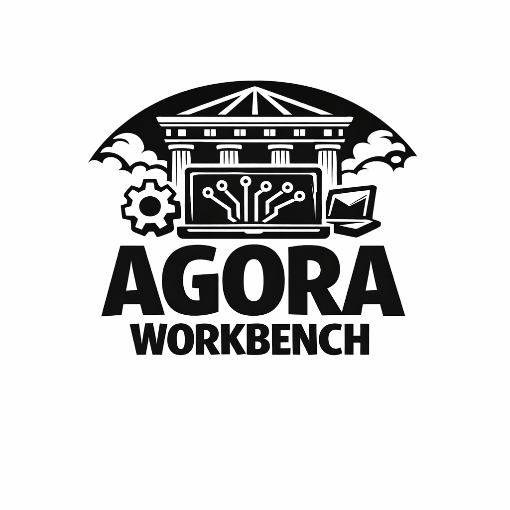

# Agora Workbench
<p align="left">
  
</p>


[](LICENSE)

A workbench for wrapping your tooling with MCP

<h2><a href="https://microsoft.github.io/agora-workbench">Documentation</a></h2>

## Overview

Agora Workbench is a toolkit for building MCP (Model Context Protocol) servers that provide sandboxed Python execution with domain-specific packages. It is agent-framework agnostic — any MCP-compatible client can take advantage of the servers created by Agora Workbench.

Use Agora Workbench to:

- **Wrap domain-specific Python tooling as MCP servers** — expose Python environments through isolated, session-aware execution environments that any MCP client can call
- **Make tools discoverable** — register tools and skills in a searchable catalog so agents can find what they need by natural-language query
- **Serve data alongside code** — attach a file catalog so agents can locate and load datasets without hardcoded paths
- **Deploy to Azure Container Apps** — use the included Bicep templates and CLI to ship your servers with Entra ID auth and managed identity

## Getting Started

### Prerequisites

- **Python 3.11+**
- **Git**
- **[uv](https://docs.astral.sh/uv/)** for dependency management
- **Docker** (required for running code execution servers locally)

### Installation

**With uv (recommended for development):**

```bash
git clone https://github.com/microsoft/agora-workbench.git
cd agora-workbench
uv sync                # install base dependencies
uv sync --group dev    # include dev tools (pytest, pre-commit, ruff, jupyter)
```

**With pip (for using as a library):**

```bash
pip install git+https://github.com/microsoft/agora-workbench.git
```

**Optional extras for examples** — the base package is all you need to build and run MCP servers. Extras pull in dependencies used by the example integrations:

| Extra | Example integration |
|-------|---------------------|
| `agent` | Microsoft Agent Framework (MAF) adapter |
| `openai-agents` | OpenAI Agents SDK adapter |
| `copilot-sdk` | GitHub Copilot SDK adapter |
| `geo` | Geospatial domain examples (rasterio, etc.) |

```bash
# uv
uv sync --extra openai-agents

# pip
pip install "agora-workbench[openai-agents] @ git+https://github.com/microsoft/agora-workbench.git"
```

### Configuration

For local testing, no external credentials are required. Use the no-op auth config to skip authentication entirely:

```python
from code_execution.auth import create_noop_auth_config
from code_execution.code_execution_models import ServerConfig

config = ServerConfig(
    name="my-server",
    description="My local test server",
    type="uv",
    dependency_file="pyproject.toml",
)
server = MyCodeExecutionServer(
    server_config=config,
    auth_config=create_noop_auth_config(),
)
```
For Docker-based local deployment and Azure Container Apps, see the [deployment guide](https://microsoft.github.io/agora-workbench/guide/deploying/). For Entra ID authentication setup, see the [authentication guide](https://microsoft.github.io/agora-workbench/guide/authentication/).

## Contributing

This project welcomes contributions and suggestions. Most contributions require you to agree to a
Contributor License Agreement (CLA) declaring that you have the right to, and actually do, grant us
the rights to use your contribution. For details, visit [Contributor License Agreements](https://cla.opensource.microsoft.com).

When you submit a pull request, a CLA bot will automatically determine whether you need to provide
a CLA and decorate the PR appropriately (e.g., status check, comment). Simply follow the instructions
provided by the bot. You will only need to do this once across all repos using our CLA.

**Guidelines:**
- For changes more complex than typos, please submit an issue first to discuss the proposed changes
- Follow the development practices outlined in the project documentation

### Contact

For questions or feedback, contact: agora@microsoft.com

This project has adopted the [Microsoft Open Source Code of Conduct](https://opensource.microsoft.com/codeofconduct/).
For more information see the [Code of Conduct FAQ](https://opensource.microsoft.com/codeofconduct/faq/) or
contact [opencode@microsoft.com](mailto:opencode@microsoft.com) with any additional questions or comments.

## Trademarks

This project may contain trademarks or logos for projects, products, or services. Authorized use of Microsoft
trademarks or logos is subject to and must follow
[Microsoft's Trademark & Brand Guidelines](https://www.microsoft.com/legal/intellectualproperty/trademarks/usage/general).
Use of Microsoft trademarks or logos in modified versions of this project must not cause confusion or imply Microsoft sponsorship.
Any use of third-party trademarks or logos are subject to those third-party's policies.
